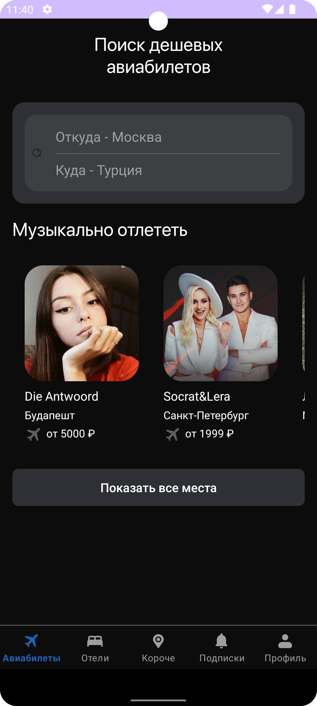
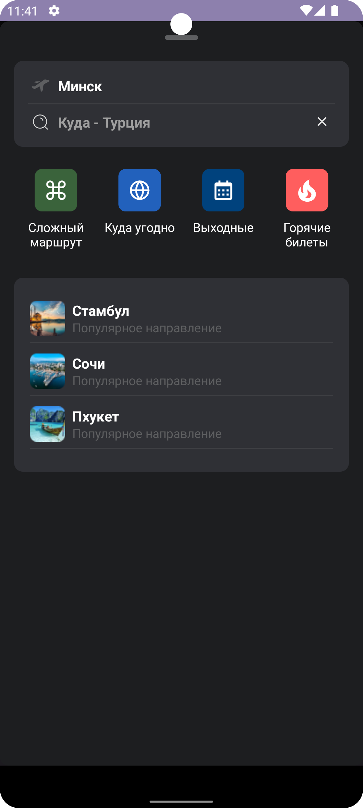
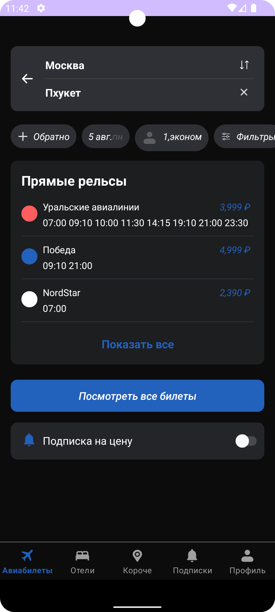
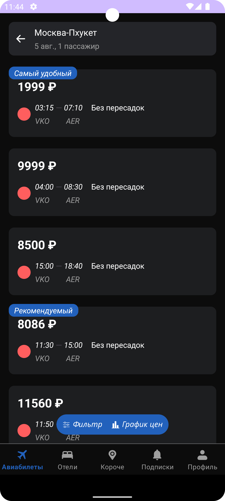

# Effective mobile test

_Тестовое задание Effective mobile_

## Скриншоты

  
  
  
  

## Stack

### Architecture
- Clean architecture
- Multi module
- MVVM

### UI
- XML
- Material 2
- AppCompat

### Asynchrony
- Coroutines
- LiveData

### Network
- Retrofit
- Gson

### Other
- Kotlin
- Android SDK
